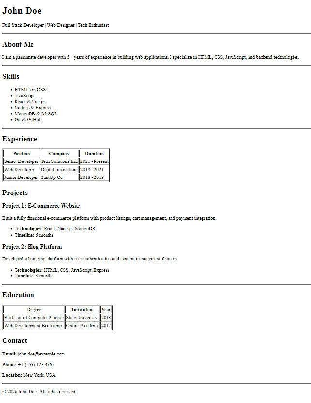

# Simple HTML Resume Website

This project is a clean, single-page resume website built using pure HTML5 as my first cohort assigment.

## How to Run
1. Download the `index.html` file in your local host.
2. Open it with any web browser (Chrome, Firefox, Safari).

## Project Structure
- `index.html`: Contains all the structure (HTML) tags for better SEO.

## Features
- Use of tables for structured data like Education and Experience.
- Semantic tags for better SEO and accessibility.